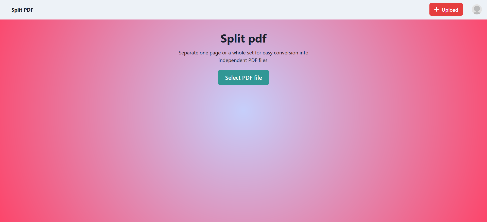

<div id="top"></div>
            
<div align="center">
  <h3 align="center">SplitPDF(Project)</h3>

  <p align="center">
     SplitPdf site provides you features like creating a new pdf from existing pdf. It also provides users to upload pdf files and access it from anywhere.
    <br />
    <br />
    <a href="https://web-pdf.vercel.app/">View Site</a>
  </p>
</div>

<!-- TABLE OF CONTENTS -->
<details>
  <summary>Table of Contents</summary>
  <ol>
    <li>
      <a href="#about-the-project">About The Project</a>
      <ul>
        <li><a href="#built-with">Built With</a></li>
      </ul>
    </li>
    <li><a href="#getting-started">Getting Started</a></li>
    <li><a href="#usage">Usage</a></li>
    <li><a href="#roadmap">Roadmap</a></li>
    <li><a href="#license">License</a></li>
    <li><a href="#contact">Contact</a></li>
    <li><a href="#acknowledgments">Acknowledgments</a></li>
  </ol>
</details>

<!-- ABOUT THE PROJECT -->
## About The Project



A PDF site with simple user intutive design. You can create a new pdf from existing pdf by selecting the required pages from the existing one.

The project was developed in conjunction with React.js, including Context, Hooks, Chakra UI, Express, React-pdf library, Pdf-Lib, Mongoose, MongoDb, Firebase.

<p align="right">(<a href="#top">back to top</a>)</p>


### Built With

* [React.js](https://reactjs.org/)
* [Chakra UI](https://chakra-ui.com/)
* [Axios](https://www.npmjs.com/package/axios)
* [Express](http://expressjs.com/)
* [Mongoose](https://mongoosejs.com/)
* [MongoDb](https://www.mongodb.com/)


<p align="right">(<a href="#top">back to top</a>)</p>


<!-- GETTING STARTED -->
## Getting Started

### Prerequisites

Before running the application, make sure you have the following installed:

- Node.js

 ### Installation

1. Clone the repository

```bash
git clone https://github.com/deekshith1856/webPdf.git
```
2. Go to the project directory and install dependencies for both the client and server

```bash
cd client
npm install
```

```bash
cd api
npm install
```

3. Start the server

```bash
cd api
npm start
```

4. Start the client

```bash
cd client
npm start
```


<p align="right">(<a href="#top">back to top</a>)</p>

